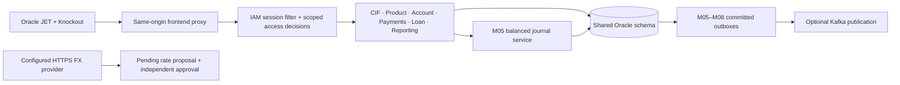

# Integration design and changes

## Architecture

The modules now form a modular monolith: one Spring application, one JDBC transaction manager, one session authority and one frontend origin. JDBC was retained because the supplied modules already encode Oracle constraints and immutable accounting semantics in explicit SQL. Replacing those repositories with an unrelated JPA schema would have weakened compatibility.

## Consolidation

The source manifest records 289 imported Java files from the supplied module code. Package boundaries were preserved. Duplicate application entry points, incompatible security configurations, independent peer HTTP clients and the original publication relay were excluded from the assembled application. A fully qualified bean-name generator avoids same-name controller and service collisions. Module exception handlers are package-scoped.

The original schema has 166 module tables. The additive statement revision table, seven banking extension tables and account override approval table bring the local fixture to **175 tables and 206 foreign keys**. No Oracle table or foreign key is renamed to fit a frontend.

| Domain | Packages / owned data | Connected API roots |
| --- | --- | --- |
| IAM | `iam`, M01 | `/api/v1/auth`, `/api/v1/iam` |
| CIF/KYC | `cif`, M02 | `/api/v1/cif` |
| Product | `product`, M03 | `/api/v1/products` |
| Accounts | `account`, M04 | `/api/v1/accounts` |
| Transactions | `txn`, M05 | `/api/v1/transactions`, `/journals`, `/fees`, `/gl`, `/reconciliation` |
| Payments | `payments`, M06 | `/api/v1/payments`, `/clearing-batches`, `/payment-exceptions`, `/rail-messages` |
| Treasury | `treasury`, M07 | `/api/v1/treasury` |
| Loans | `loan`, M08 | `/api/v1/loans` |
| Privacy | `privacy`, M09 | `/api/v1/privacy` |
| Statements | `statements`, M10 | `/api/v1/reporting` |
| Added workflows | `integration`, MBX | `/api/v1/banking`, `/teller`, `/beneficiaries`, `/fx`, `/currencies`, `/customer-access` |

Consult the running OpenAPI document for exact methods, bodies and status codes; roots in this table are orientation, not a substitute for the contract.

## Identity and financial-detail access

All modules use M01 bearer sessions. Compatibility aliases translate existing permission names into the authorities expected by imported modules; an authenticated session alone grants no banking authority. Account access checks branch, product, currency and current CIF links. Customer ownership is verified against active account parties. Separate maker/checker identities and approval authorities apply to controlled operations. Direct journal and rail orchestration endpoints are restricted to service identities.

Customer creation issues a random 256-bit base64url account-holder key. Only its SHA-256 digest is stored, under an M01 user foreign key. The plaintext is returned once; rotation invalidates the prior value. Signed-in customers can view financial details for their own active linked accounts without this key. Authorized officers send it in `X-Customer-Hash`; the browser keeps it only in memory and clears it at logout. It supplements officer authentication and authorization. It is not a public customer identifier or password.

A response advice covers transaction/payment reads and write receipts. The list serializer was normalized after testing found that typed lists could otherwise fail when identifier-only maps replaced full records. Account balances, positions, statement generation and downloads also enforce detail access. Financial access produces audit events. Global operational totals and non-transaction contract/configuration data have their own role checks; hash gating is not a universal substitute for institution-wide field-classification policies.

## Ledger and account integration

Account controls apply synchronously through the M05 posting fence and M04 acknowledgement inside a shared transaction. A freeze is effective before the API reports completion. Available balances are read from M05 positions, not editable account projection fields.

Transfers lock the source for velocity checks and rely on sorted ledger position locks for posting. They validate product rules, funds and directional fences, then insert balanced immutable journal lines. Canonical request hashes detect conflicting idempotency replays. Daily limits count reversed original transfers as usage. Backdated immediate transfers are rejected to prevent bypassing current-day limits.

Teller deposits/withdrawals, fee collection, simulated payment debits/refunds/settlements and loan disbursements/accruals/repayments call the same balanced journal service. Balance projections are updated in the posting transaction. Corrections use explicit reversal workflows rather than editing history.

Account override approval is stored against account, product version, exact command digest, maker, nominated checker and a 24-hour expiry. Independent IAM amount/rate authority is checked before approval. The original maker applies the unchanged command; changed payloads and stale product versions fail. Consuming approval and changing the account occur in the same transaction.

## Payments and loans

The payment simulator connects beneficiary ownership, separate authorization, liquidity reservation, customer holds, suspense debit, dispatch evidence and final reserve settlement. Outcomes are explicit operations; unknown outcomes do not silently release funds. This is not a live UPI/RBI adapter. Original clearing-batch, retry and exception APIs remain available, but automated net-cycle scheduling and remote delivery need deployment adapters.

Loan servicing is deliberately bounded to fixed-rate, monthly, single-disbursement, reducing-balance contracts. Schedules use equal principal, interest on the outstanding balance and supported day-count conventions. Accrual posts due installment interest; repayment allocates oldest due interest before principal. Unsupported fee/penalty allocations and early prepayment fail explicitly. No daily floating-rate engine is implied.

## Frontend contract

`frontend/app.js` owns the shell and Oracle JET CoreRouter. `banking.js` defines workspace routes and renders workflow forms from OpenAPI; `jet.js` binds values through Knockout and Oracle JET input components. `api.js` normalizes wrapped and unwrapped responses, attaches session/hash headers and handles downloads. The Node server serves an explicit asset allowlist and proxies only API/documentation paths to the configured backend.

Frontend amounts and long IDs are submitted as validated strings so browser floating-point conversion does not alter them. Nested optional commands, repeatable journal lines, JSON extension fields, generated request keys and `If-Match` headers are supported. Backend validation and authorization remain authoritative. Not every workflow has a bespoke guided wizard; operations workspaces expose the real domain commands.

## References

The maker/checker and modular banking concepts were compared with [Apache Fineract documentation](https://fineract.apache.org/docs/legacy/). No Fineract API compatibility is claimed. Navigation and AMD loading follow the [Oracle JET SPA guidance](https://docs.oracle.com/en/middleware/developer-tools/jet/12/develop/design-single-page-applications-using-oracle-jet.html) and [RequireJS integration guidance](https://docs.oracle.com/en/middleware/developer-tools/jet/10/develop/oracle-jet-and-requirejs.html). The installed JET version is pinned in the package lock.
